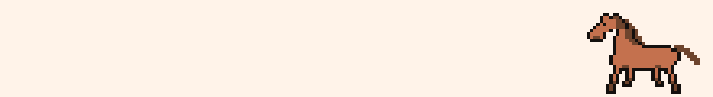

# 🐴 Desktop Farm Pets

바탕화면을 돌아다니는 픽셀 목장 친구들. Windows에 기본 내장된 PowerShell만으로 동작하는 데스크탑 펫 위젯입니다. 설치할 것이 아무것도 없습니다.

## 친구들

| | 이름 | 하는 일 |
|---|---|---|
| 🐴 | **말** | 모니터 사이를 질주하고, 풀을 뜯고, "뿌지직..." 하며 흔적을 남기고 도망갑니다 |
| 🐈 | **고양이** | 작업표시줄 위를 어슬렁거리다가 앉아서 꼬리를 살랑거립니다 |

## 웹 데모

브라우저에서 바로 체험할 수 있는 웹 버전이 `index.html`에 들어 있습니다.
GitHub Pages를 켜면(Settings → Pages → Deploy from a branch → main, / root) 배포 링크가 생깁니다.
PowerShell 원본과 같은 상태 머신을 그대로 이식해서, 동작 하나하나가 실제 위젯과 같습니다.

## 실행 방법

1. 이 저장소를 다운로드합니다 (Code → Download ZIP)
2. `start_horse.bat` 또는 `start_cat.bat` 더블클릭
3. 끝!

> 회사 PC는 보안 정책에 따라 스크립트 실행이 차단될 수 있습니다.

## 조작

- **클릭**: 점프 (말은 장애물을 넘듯 크게 도약합니다)
- **우클릭**: 종료
- **응가 우클릭**: 치우기 (안 치우면 21초 뒤 스스로 사라집니다)

## 특징

- **의존성 제로**: Windows 내장 PowerShell + WPF만 사용. Python도 Node도 필요 없음
- **픽셀아트 내장**: 모든 프레임이 base64 PNG로 스크립트 안에 들어있어 파일 하나로 완결
- **행동 상태 머신**: 질주(목적지 기반) / 서기 / 풀뜯기 / 응가를 확률적으로 오가며, 풀을 뜯고 나면 응가 확률이 올라갑니다
- **다중 모니터 지원**: 모니터별 해상도·배율·작업표시줄 높이가 달라도 각 모니터의 바닥을 정확히 밟습니다. 모니터 배치상 존재하는 데드존(어느 화면에도 안 보이는 좌표 구간)은 감지해서 건너뜁니다
- **투명 클릭 통과**: 캐릭터 몸통 외의 영역은 클릭이 뒤로 통과해 작업을 방해하지 않습니다

## 기술 노트

- PowerShell 5.1 + WPF (투명 레이어드 윈도우, DispatcherTimer 30ms 루프)
- 픽셀아트는 Python PIL로 그린 뒤 base64로 스크립트에 인라인
- 다중 모니터 좌표는 변환 계수 계산 대신 WPF `PointToScreen`/`PointFromScreen`으로 매 프레임 실측하여, 배율이 섞인 구성에서도 자기 일관성을 보장
- 응가는 별도의 투명 윈도우로 생성되어 말이 떠나도 바닥에 남습니다

## 만든 과정

Claude와의 페어 프로그래밍으로 만들었습니다. 이모지가 흑백으로 나오는 렌더링 문제 → 픽셀아트 내장, 2프레임 걷기가 어색한 문제 → 4단계 걸음 사이클, 3모니터 혼합 배율에서 좌표가 어긋나는 문제 → 진단 스크립트로 실측 후 수정까지, 실제 발생한 문제를 하나씩 해결하며 발전시켰습니다.
